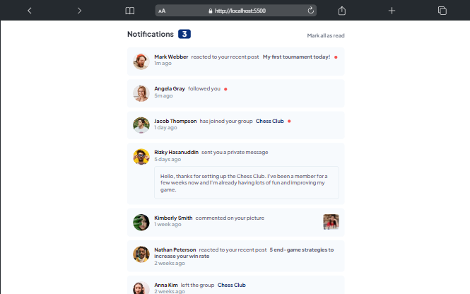
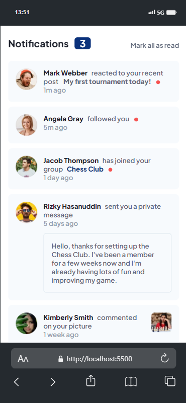

# Welcome! 👋

# Frontend Mentor - Manage landing page

This is a solution to the [Notifications page challenge on Frontend Mentor](https://www.frontendmentor.io/challenges/notifications-page-DqK5QAmKbC). Frontend Mentor challenges help you improve your coding skills by building realistic projects. 

## Table of contents

- [Overview](#overview)
  - [The challenge](#the-challenge)
  - [Screenshot](#screenshot)
  - [Links](#links)
- [My process](#my-process)
  - [Built with](#built-with)
  - [What I learned](#what-i-learned)
  - [Continued development](#continued-development)
- [Author](#author)

## Overview

### The challenge

Users should be able to:

- Distinguish between "unread" and "read" notifications
- Select "Mark all as read" to toggle the visual state of the unread notifications and set  the number of unread messages to zero
- View the optimal layout for the interface depending on their device's screen size
- See hover and focus states for all interactive elements on the page

### Links

- Live Site URL: [Notifications page](https://liwgar.github.io/004_fm_notifications_page/)

### Screenshot

  

  

  
  

## My process

### Built with

- Git & Github.
- Semantic HTML5 markup
- CSS3 custom properties
- Flexbox
- Mobile-first workflow

### What I learned

- Apply responsive design for any device.
- Apply flexbox.
- Improve semantic HTML5 markup.
- Improve CSS custom properties.

### Continued development

The objective is:
- Improve the practice of styles with flexbox and grid.

## Author

- Website - [LiwGAr](https://liwgar-portfolio.vercel.app/)
- Frontend Mentor - [@Liwgar](https://www.frontendmentor.io/profile/LiwGar)

## Solution

I've just completed a front-end coding challenge from @frontendmentor! 🎉

You can see my solution here: https://www.frontendmentor.io/solutions/notifications-page-using-css-flexbox-7AfpNwpjc1

Any suggestions on how I can improve are welcome!
